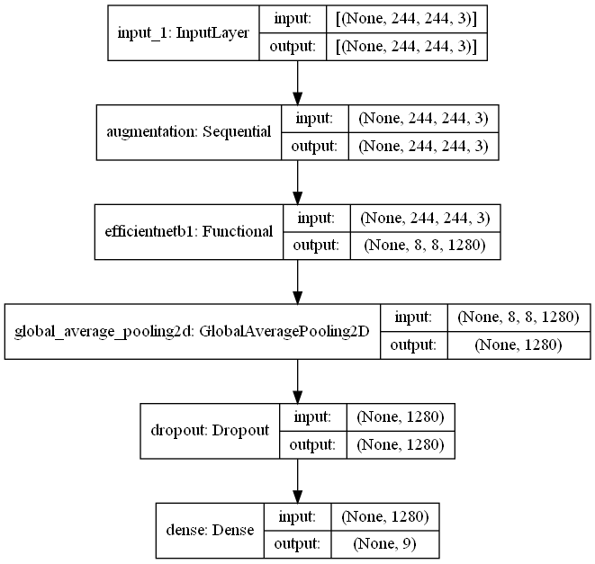

# dog-searching

`train.py` - Start model training

`predict.py path [path ...]` - Get predictions from images

`clean_dataset.py` - Clean dataset of trash files. It's already done for `dataset` folder

`app.py` - Backend server

# Model architecture

